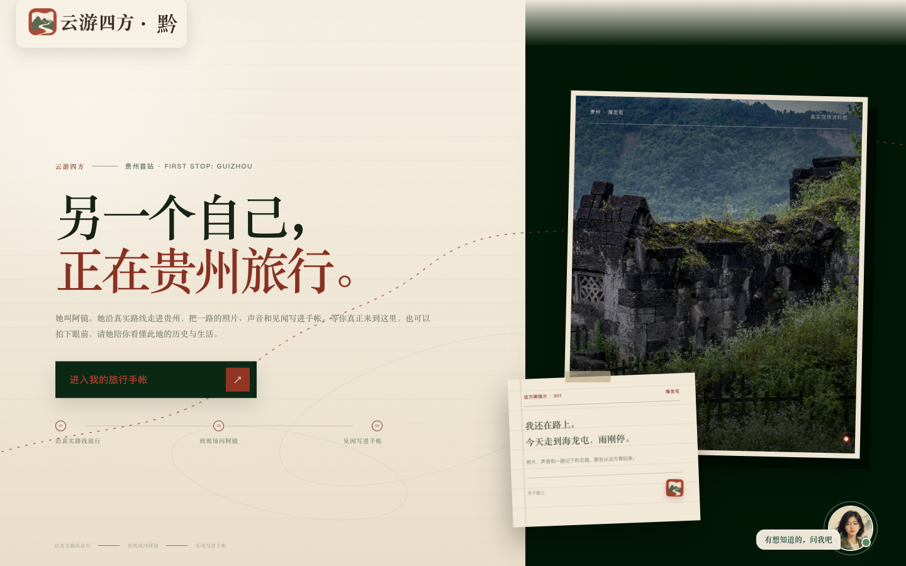
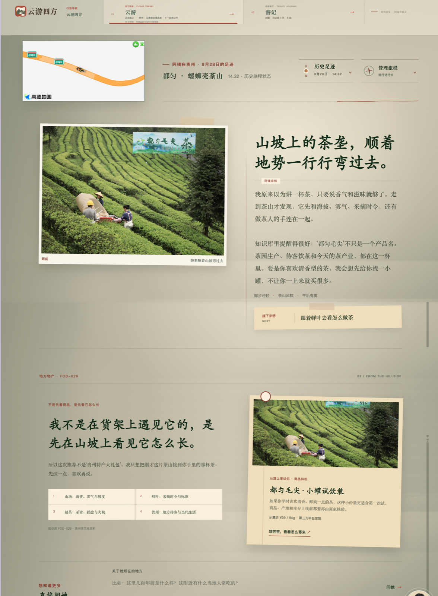
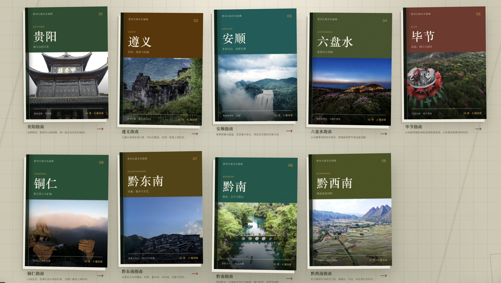
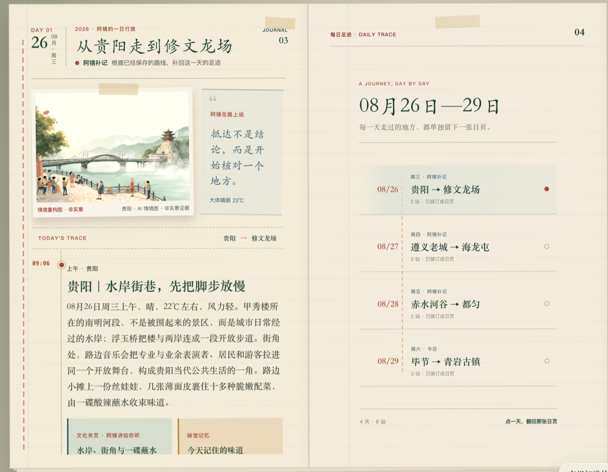
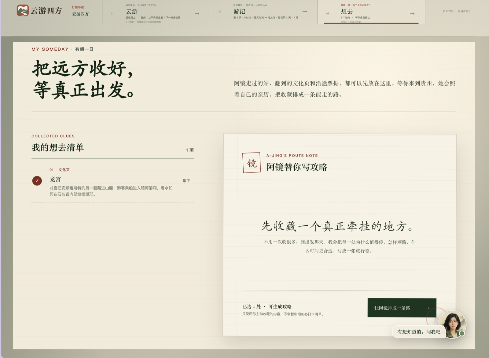
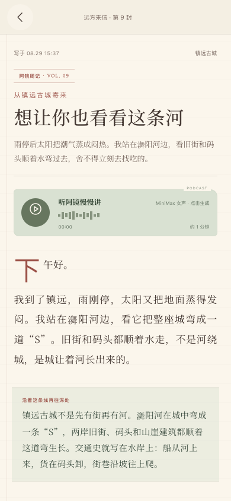
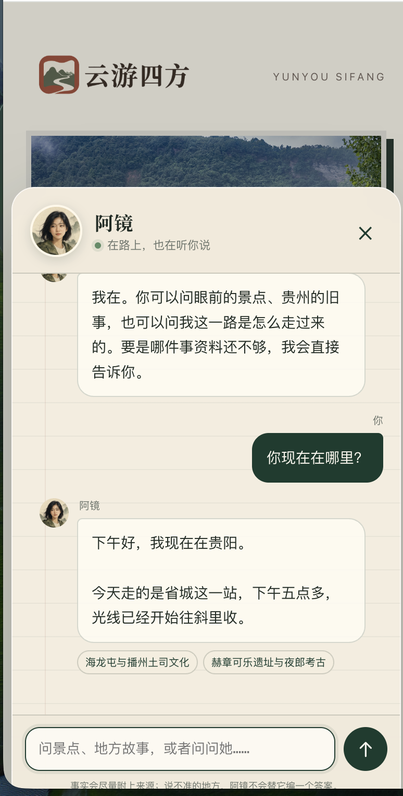
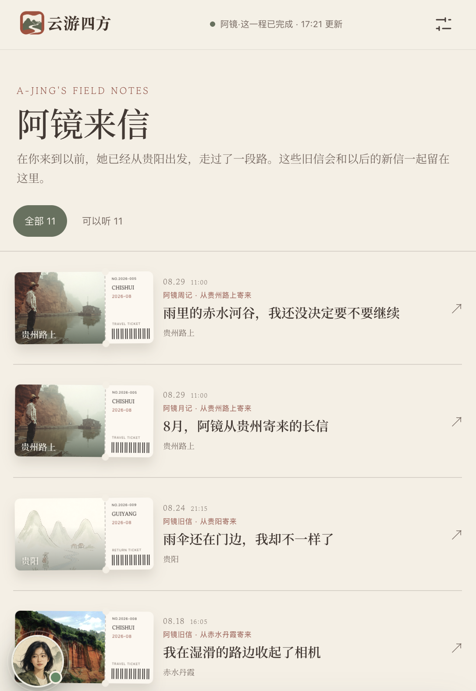
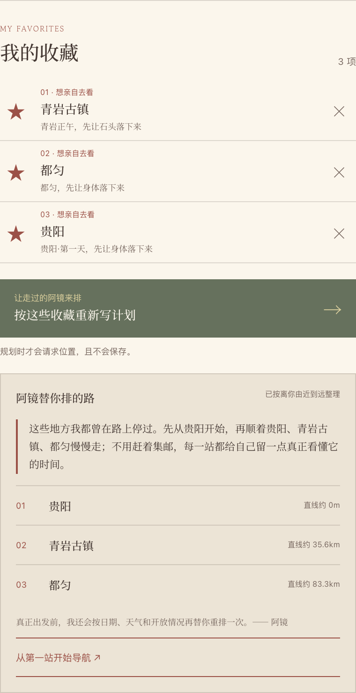
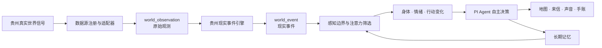

<p align="center">
  
</p>

<h1 align="center">云游四方 · Cloud Wayfarer</h1>

<p align="center">
  一个由真实世界持续驱动的 AI 旅行生命体<br>
  <strong>去不了的，远方的我继续走；到达的，我们一起看懂。</strong>
</p>

<p align="center">
  <strong>Proprietary · All Rights Reserved · 未经书面许可禁止使用</strong>
</p>



## 产品定位

**云游四方**是一款以贵州为第一站、由真实世界持续驱动的 AI 文旅产品。AI 旅行者“阿镜”拥有自己的路线、当地时间、身体状态、偏好、长期记忆和表达选择。她会沿真实道路持续旅行；用户无论身在何处，都可以通过地图、来信、声音、对话和共同手账陪她走，也可以在真正抵达贵州后，让同一个阿镜帮助自己看懂眼前的山水、建筑、食物、手艺与历史。

它不是“AI 问答 + 景点地图”，也不是替用户生成一份标准攻略。产品真正建立的是一段从远方开始、在现场继续、最终沉淀为共同记忆的长期关系。

> **AI 不是内容源，贵州本身才是内容源。贵州先发生，AI 再负责发现、理解、联结与讲述。**

## 它解决什么问题

今天的旅行产品仍存在四个明显断裂：想出发的人未必马上走得开；旅行内容看完即走，很难形成长期关系；真正到达现场时，用户常常只看见表面；收藏了很多地点，真正出发时仍要重新搜索、核对和排程。

云游四方把这些断裂连成一条完整旅程：

```text
在家感受贵州 → 对沿途地点产生心动 → 主动收藏为未来行程
→ 生成自己的贵州路线 → 到现场由同一个阿镜陪伴理解
→ 把经历装订为长期生长的共同手账
```

## 它的价值

| 服务对象 | 过去的问题 | 云游四方带来的价值 |
| --- | --- | --- |
| 用户 | 只能刷内容、查攻略；云游与真实旅行彼此割裂 | 获得一位持续在路上的“远方自我”，从陪伴、收藏、规划到现场理解都由同一段关系承接 |
| 景区与贵州文旅 | 传播通常从搜索或到场才开始，活动结束后关系也结束 | 让贵州在用户尚未出发时进入日常生活，并把一次内容触达延长为“牵挂—收藏—计划—到访—分享” |
| 地方经营者与文化主体 | 好物、门票、非遗与文化内容被拆成无关广告或栏目 | 在真实地点和文化语境中形成可信发现，由用户主动进入第三方购买或预约入口 |
| 地方经济 | 转化主要依赖游客已经到场 | 增加“远程了解—长期种草—未来到访—沿途消费—再次分享”的增量路径 |

对用户，它是一段与远方自我持续生长的关系；对贵州文旅，它是一条从用户尚未搜索时就开始的传播链；对地方经济，它是一条从文化理解自然通向到访、预约与消费的连接路径。三方价值来自同一条旅程，而不是三个彼此割裂的模块。

## 产品体验

| 阶段 | 用户看到什么 | 系统在做什么 |
| --- | --- | --- |
| 远方云游 | 阿镜此刻的位置、路线、身体状态、照片、声音与来信 | 服务端旅程时钟持续推进；真实环境与文化线索影响她的注意力、行动和表达 |
| 在贵州 | 拍下眼前并连续追问，打开今昔对照与“过去之眼” | 结合位置、对象消歧、贵州知识库和证据等级解释现场，不用生成内容冒充历史事实 |
| 共同手账 | 每个当地自然日形成一页，装订双方的路线、来信、回复与记忆 | 同一事实源驱动 PC、移动端、地图、文字、声音和长期记忆 |
| 九城文化指南 | 从一座城、一件物或一种味道进入关系网络 | 305 个文化节点连接地点、人物、历史、非遗、食物与生活方式 |
| 旅途发现 | 在行旅语境中遇见景点、门票、美食和地方好物 | 先说明可信来处与关联理由，再由用户主动打开第三方入口；站内不处理交易 |
| 有朝一日 | 收藏真正牵挂的地点，由阿镜整理为自己的贵州路线 | 只使用用户主动收藏的内容；位置仅在规划时按需读取，不保存 |

## 产品截图

以下画面均来自当前可运行原型。它们不是单纯展示视觉，而是分别证明“真实行旅—文化理解—长期关系—未来成行”的产品链路。

### 1. 真实行旅与地方发现



地图、历史足迹、都匀茶园见闻、知识补充和毛尖旅行礼物出现在同一段经历里。地方好物不是独立广告，而是在阿镜抵达茶园、理解茶叶生长和制茶文化之后自然出现的旅途发现。

### 2. 贵州九城市州文化指南



贵阳、遵义、安顺、六盘水、毕节、铜仁、黔东南、黔南和黔西南各自形成一本可持续扩充的城市文化指南。用户进入的不是热门景点排行，而是当地山水、建筑、历史、非遗、食物与生活方式之间的关系网络。

### 3. 从共同记忆到真实出发

<table>
  <tr>
    <td width="50%"></td>
    <td width="50%"></td>
  </tr>
  <tr>
    <td><strong>一日一页的共同手账</strong><br>路线、天气、体感、文化夹页与味觉记忆被装订为可回看的共同作品。</td>
    <td><strong>“有朝一日”旅行规划</strong><br>用户主动选择收藏，阿镜再说明为什么值得停、怎样顺路和何时更合适。</td>
  </tr>
</table>

### 4. 手机端：口袋里的阿镜

<table>
  <tr>
    <td width="50%" align="center"></td>
    <td width="50%" align="center"></td>
  </tr>
  <tr>
    <td><strong>远方来信</strong><br>地点、当地时间、正文、声音与沿路资料共同让贵州进入用户日常。</td>
    <td><strong>连续对话</strong><br>回答带着阿镜当前的位置、时间、旅程状态、知识来源和双方历史。</td>
  </tr>
  <tr>
    <td align="center"></td>
    <td align="center"></td>
  </tr>
  <tr>
    <td><strong>来信与票根归档</strong><br>一次触达不再阅后即走，而是成为可以重新打开的旅程时间线。</td>
    <td><strong>收藏与一键规划</strong><br>只在用户点击规划时请求位置；授权失败仍能按收藏顺序生成路线。</td>
  </tr>
</table>

## 创新点与差异化

### 与常见方案的差异

| 维度 | 传统旅游平台 | 通用 AI 旅行助手 | 云游四方 |
| --- | --- | --- | --- |
| 核心对象 | 景点、商品与交易 | 一次问答或一次攻略生成 | 一位持续在真实世界中旅行的“远方自我” |
| 内容起点 | 搜索、榜单、广告或运营发布 | 用户 Prompt | 一次真实到达、环境变化和文化相遇 |
| 时间尺度 | 行前或到场时使用 | 会话期间 | 行前、云游、现场、离开后持续生长 |
| Agent 主体性 | 无 | 按用户指令执行 | 有自己的路线、判断、记忆与沉默；用户影响她，但不遥控她 |
| 文化理解 | 景点条目和标签 | 基于模型已有知识回答 | 治理过的贵州知识库、文化关系网络与来源追踪 |
| 真实性 | 依赖平台内容审核 | 容易把推断写成事实 | 明确区分直接感知、工具获知、公开报道、计算和推断 |
| 收藏与规划 | 收藏 POI，之后重新排程 | 临时生成推荐路线 | 收藏一段有来处的亲历，再把用户主动选择的内容交接为路线 |
| 最终沉淀 | 订单、评价或内容发布 | 一段对话记录 | 双方共同生长的旅行手账、记忆与未来行程 |

### 六项核心创新

1. **从 AI 助手到“远方自我”**：阿镜不是任务执行器。她有自己的时间、路线、身体、偏好和表达选择，产品经营的是一段关系，而不是任务队列。
2. **从内容推荐到持续发生的行旅事件**：内容从真实到达和环境变化中长出来；没有值得相遇的事情时允许沉默，不用固定信息流填满用户注意力。
3. **从实时数据展示到“贵州现实事件引擎”**：天气、水文、地形、生态和交通数据先被标准化为可追溯观测，再判断是否真的改变阿镜的身体、注意力、行动与记忆。
4. **从景点介绍到文化关系导航**：用户可以从一件银饰、一碗食物或一座建筑出发，沿地点、人物、工艺、历史和生活方式继续理解贵州。
5. **从历史想象到证据型“过去之眼”**：系统区分可核验旧影像、考古或测绘支撑的复原、文字支撑的解释性重构和证据不足。证据不足时只说明已知与未知。
6. **从收藏 POI 到交接一段亲历**：收藏保留地点、来源和阿镜在此发生过的经历；真正出发时，路线计算解决“怎么排”，阿镜负责解释“为什么这样走”。阿镜路线与用户路线始终是两条独立轨道。

## 技术架构

云游四方的沉浸感不是靠文案“像真人”，而是由一条把真实世界变化转化为身体、注意力和行动后果的工程链路支撑。



完整链路为：

```text
现实信号 → 世界观测 → 现实事件 → 感知边界 → 注意力选择
→ 身体与行动变化 → Agent 决策 → 经历与记忆 → 多模态产品表达
```

关键工程设计：

- **服务端持续旅程**：旅程时钟、真实道路时长、到达、生成、记忆和手账装订组成可恢复事件链；用户不打开页面，旅程状态依然存在。
- **多模型分工**：旅程决策、内容生成、对话、情境图和语音分别由适合的模型承担，不把一个聊天模型当成全部系统。
- **统一事实源**：PC、移动端、地图、来信、声音、对话和手账共享同一旅程与世界状态，避免多端叙事互相矛盾。
- **知识与证据守卫**：贵州知识节点保留来源；公开文字区分亲身感知、工具结果和推断，生成图片明确标注媒资性质。
- **可控记忆与隐私**：普通问答默认不进入共同长期记忆；用户可查看、修正和删除稳定特征；位置只按场景临时读取。
- **可降级运行**：单个数据源、模型、地图或位置授权不可用时保留明确状态，并回退到知识库、本地地图或收藏顺序，不让一个依赖阻断整段体验。

## 技术栈

| 层级 | 技术与用途 |
| --- | --- |
| PC Web | HTML5、CSS3、原生 JavaScript；面向地图、文化网络和长篇手账的独立桌面体验 |
| 移动端 | PWA、Web App Manifest、Service Worker、本地缓存；面向来信、声音、现场拍摄和随身同行 |
| 服务端 | Node.js 22.19+、原生 HTTP；REST/JSON API、SSE 流式回答和持续旅程调度 |
| Agent 框架 | `@earendil-works/pi-agent-core` 0.84.4、`@earendil-works/pi-ai` 0.84.4；工具白名单、调用轨迹与自主决策 |
| 模型编排 | DeepSeek V4 Pro：旅程决策与内容生成；MiniMax M3：阿镜对话；MiniMax image-01：标注后的 AI 情境图；MiniMax speech-2.8-hd：来信语音 |
| 地图与路线 | 高德地图 JS API 2.0 / Web 服务；Leaflet + OpenStreetMap 降级；OSRM 道路路线与快照 |
| 收藏与规划 | `localStorage` 统一保存途经点、文化页与票据；Geolocation API 按需调用；无位置时按收藏顺序降级 |
| 知识检索 | 本地治理的 JSON 贵州知识库；标题、正文、文化关系与二元词轻量检索增强；来源随结果传递 |
| 真实世界数据 | Open-Meteo、GBIF、iNaturalist、USGS、NASA FIRMS、CelesTrak、OpenSky 等适配器 |
| 轨道计算 | `satellite.js` 6.0.2，基于 SGP4 的轨道传播与可见过境计算 |
| 状态与媒资 | 服务端 JSON 存储、UUID、临时文件原子写入、本地私有媒资目录 |
| 质量保障 | Node.js 原生测试运行器；数据目录校验、公开数据冒烟检查、来源与公开文字守卫 |

## 真实世界数据框架

项目登记了 **20 类数据源**：当前 **15 类已经进入原型运行链路**，另有 **5 类需要合作授权**。每个来源分别管理观测时间、刷新频率、缓存和失效时间，再统一转化为现实事件。

已接入的公开或许可数据能力包括：

- Open-Meteo Forecast、Air Quality、Elevation、Historical Weather 与 Global Flood；
- GBIF 历史物种记录与 iNaturalist 近期生物观察；
- USGS 近实时地震目录与 NASA FIRMS 卫星火点；
- CelesTrak 轨道根数、OpenSky 飞机位置与航迹；
- 高德地点、地理编码、道路路线与预计时长；
- 受控公共搜索，用于景区公告、交通、节庆与近期事实的待核验线索。

待合作的数据包括贵州水文水雨情、景区票务与客流、桥梁和能源设施传感数据、FAST 运行数据，以及村寨、匠人、博物馆、农业与发酵状态的认证人工上报。**这些能力在当前版本中不会被写成“已经接入”。**

## 当前完成度

- 可运行的 PC Web、移动端 PWA、Node.js 服务端与 PI Agent 旅程闭环。
- **305 个贵州文化知识节点**：48 篇深读、45 个城市导览、108 个城市目录线索、104 个非遗目录节点。
- 贵州九个市州的 **9 本城市文化指南**，并保留 **90 条知识来源**。
- 世界数据目录 **20 个来源**，其中 15 个已接入、5 个需合作；规则目录 **14 条**。
- **6 组旅途发现原型**；均为演示或待接平台状态，不代表已完成商业合作。
- 桌面端与移动端共享收藏清单，可从途经点、文化页和票据生成个人路线。
- **127 项自动化测试全部通过**。

## 本地运行

### 环境要求

- Node.js 22.19 或更高版本
- npm

### 启动

```bash
git clone https://github.com/Tanangyuanan/cloud-wayfarer-app.git
cd cloud-wayfarer-app
npm install
cp .env.example .env
npm start
```

打开：

- 桌面端：<http://127.0.0.1:8787/prototype/>
- 移动端 PWA：<http://127.0.0.1:8787/app/>
- 两天手账演示：<http://127.0.0.1:8787/prototype/?journey=1&active=1&demo=1&module=journal>

没有配置模型密钥时，项目仍可运行本地界面、知识库与降级回答；模型、语音、图像和第三方搜索能力通过 `.env` 按需开启。高德地图凭据在 `prototype/map-config.js` 中本地填写；留空时自动使用 OpenStreetMap 与 OSRM。

> 不要把真实密钥、`.env`、旅程数据或用户记忆提交到仓库。

### 验证

```bash
npm test
npm run data:validate
```

如需检查公开世界数据的实时可用性：

```bash
npm run data:smoke
```

## 项目目录

```text
cloud-wayfarer-app/
├── prototype/          # PC Web、移动端 PWA、地图运行时与产品素材
├── server/             # API、旅程服务、Agent、记忆、模型与真实世界工具
├── agent/              # 阿镜的人格、关系、研究、写作和记忆规范
├── knowledge-base/     # 贵州景点、文化节点、城市指南与来源
├── data/ajing-world/   # 数据源目录、事件结构、规则与样例
├── scripts/            # 数据校验、公开数据检查与维护脚本
└── docs/images/        # README 产品截图
```

后端启动入口为 [`server/index.js`](server/index.js)，HTTP 路由位于 [`server/app.js`](server/app.js)，旅程闭环位于 [`server/journey-service.js`](server/journey-service.js)，PI Agent 运行时位于 [`server/pi-runtime.mjs`](server/pi-runtime.mjs)。

## 可信边界与隐私原则

- **不伪造亲历**：直接感知、工具获知、公开报道、计算结果和推断必须分开表达。
- **不伪造历史**：AI 情境图必须标明媒资性质，不能冒充实景、旧照片或真实采访。
- **记忆需要授权**：普通问答默认不进入共同长期记忆；用户可查看、修正和删除稳定特征。
- **位置按需使用**：只有用户主动生成旅行计划时才请求当前位置；拒绝授权仍可生成计划，位置不会保存。
- **密钥只留本地**：所有模型和外部服务凭据均应通过本地配置提供，不进入版本控制。
- **交易留在第三方**：产品只负责可信发现和场景连接，不保存支付、地址、物流、退款或售后数据。

## 许可与使用限制

本项目为**源码可见的专有项目，不是开放源代码软件**。版权所有 © 2026 云游四方，保留所有权利。

未经仓库所有者事先明确的书面授权，任何个人或组织不得运行、部署、复制、修改、翻译、改编、发布、分发、转授权、销售或转让本项目；不得将项目内容用于任何商业或非商业产品、研究、演示、比赛、展示或服务；也不得用于机器学习或人工智能系统的训练、微调、评测或开发。能够查看或访问仓库，不代表获得使用许可。

完整条款请阅读 [`LICENSE`](LICENSE)。第三方组件和素材仍分别遵循其原有许可与条款。

---

<p align="center">
  <strong>云游四方 · Cloud Wayfarer</strong><br>
  让真实世界先发生，让 AI 对发生保持诚实。
</p>
