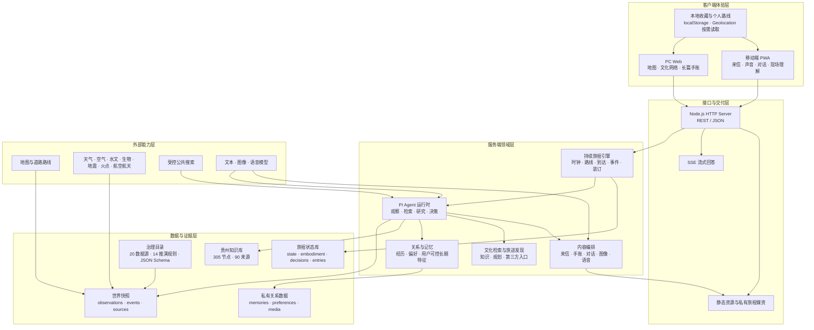
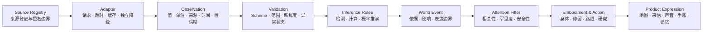

<p align="center">
  
</p>

<h1 align="center">云游四方 · Cloud Wayfarer</h1>

<p align="center">
  一个由真实世界持续驱动的 AI 旅行生命体<br>
  <strong>去不了的，远方的我继续走；到达的，我们一起看懂。</strong>
</p>

<p align="center">
  <strong>Proprietary · All Rights Reserved · 未经书面许可禁止使用</strong>
</p>


## 产品定位

**云游四方**是一款以贵州为目的地、由贵州真实世界持续驱动的 AI 文旅产品。AI 旅行者“阿镜”拥有自己的路线、当地时间、身体状态、偏好、长期记忆和表达选择。她会沿贵州真实道路持续旅行；用户无论身在何处，都可以通过地图、来信、声音、对话和共同手账陪她走，也可以在真正抵达贵州后，让同一个阿镜帮助自己看懂眼前的山水、建筑、食物、手艺与历史。

它不是“AI 问答 + 景点地图”，也不是替用户生成一份标准攻略。产品真正建立的是一段从远方开始、在现场继续、最终沉淀为共同记忆的长期关系。

> **AI 不是内容源，贵州本身才是内容源。贵州先发生，AI 再负责发现、理解、联结与讲述。**

## 它解决什么问题

### 用户侧：四个被忽略的断裂

1. **想出发，但现实中的自己走不开。** 时间、预算、身体状态和家庭责任，让很多人的旅行愿望长期停留在“以后再说”。短视频可以提供片刻代偿，却很难形成一段真正持续的远方体验。
2. **旅途结束，体验也被迫结束。** 传统产品主要服务搜索、订票和到场，离开目的地后，关系通常只剩订单、照片和偶尔翻看的游记，难以继续生长。
3. **人已经到了，却只看见表面。** 用户站在一座古桥、一件银饰或一碗食物面前，仍可能不知道它为何出现在这里、与当地人的生活有什么关系，更难把眼前所见连接到贵州的历史与文化。
4. **收藏了很多地方，却很难真正用起来。** 用户在小红书、抖音、旅游平台和朋友分享中不断收藏地点，但位置、距离、顺序、开放状态和文化背景彼此割裂。真正出发时，仍要从头搜索、核对和排程。

### 文旅侧：传播与转化之间的四个断点

1. **传播开始得太晚。** 多数目的地只有在用户主动搜索或已经到达时才进入视野，错过了更早建立情感牵挂的阶段。
2. **活动式曝光难以持续。** 一次推介、一次热搜或一条爆款内容可以带来流量，却很难沉淀为跨越数月甚至数年的到访意愿。
3. **文化与消费彼此割裂。** 景点介绍、非遗知识、门票预约和地方好物常被放在不同栏目，用户看到了商品，却未必理解它为什么值得信任、为什么与这段旅程有关。
4. **地方好物缺少可信语境。** 当商品以广告形式突然出现，地方经营者、手艺人和文化主体很难把产地、工艺、人物和旅途关系一并讲清楚。

问题的本质是：**旅游内容与用户之间只有触达，没有关系；传播与转化之间只有曝光，没有连接。**

云游四方不是再增加一个攻略入口，而是把这些断裂连接成一段由贵州真实世界持续驱动的完整旅程：

```text
在家感受贵州 → 对沿途地点产生心动 → 主动收藏为未来行程
→ 生成自己的贵州路线 → 到现场由同一个阿镜陪伴理解
→ 把经历装订为长期生长的共同手账
```

## 它的价值

云游四方的价值不是几个孤立功能的相加，而是让同一段关系同时形成三条彼此咬合的长期链路。

### 1. 用户关系链：让“想去”逐步变成“真的出发”

```text
收到阿镜的贵州生活 → 通过来信、照片、声音和地图持续了解
→ 对沿途地点与文化产生牵挂 → 主动收藏 → 生成自己的贵州路线
→ 抵达后由同一个阿镜陪伴理解 → 共同经历进入旅行手账
```

用户不必先搜索贵州，也不必在决定出发时从零开始规划。阿镜先以一个正在贵州生活和旅行的“远方自我”进入用户日常，让关系从**知道、关心、收藏、计划、到访、理解，最终走向记住**。

收藏在这里也不只是 POI 书签。用户收藏的是阿镜亲历过的一段路、一个地方和它背后的文化语境；当旅行条件成熟，这些长期沉淀的意愿可以直接被激活为路线。云游与真实出发因此不再是两套产品，而是同一段旅程的前后半程。

### 2. 贵州文旅传播链：把一次曝光变成持续关系

```text
贵州的地点、天气、季节、文化事件与公共数据发生变化
→ 影响阿镜的行动、身体、注意力与表达
→ 形成有时间、有路线、有缘由的来信与手账
→ 贵州在用户尚未搜索时进入日常生活
→ 心动沉淀为收藏、路线、到访、分享与口碑
```

这条链路改变的首先是文旅传播的**时间结构**：传播不再只发生在一次活动、一次投放或用户到场之后，而是由贵州真实世界的持续变化不断触发。九个市州的文化指南、文化关系网络和共同手账，也会从一次性内容变成可以长期积累、更新和复用的数字资产。

它还改变了目的地与潜在游客的关系。一个景点、一门手艺或一种地方味道，可以在数月甚至数年前先成为用户牵挂和收藏的一部分；当条件成熟，原本分散的兴趣会被重新组织为贵州路线、跨城联游和真实到访。

### 3. 地方经济转化链：让消费发生在理解与信任之后

```text
阿镜在真实旅途中遇见景点、食物、票据和地方好物
→ 讲清它的来处、人物、工艺以及与此刻旅程的关系
→ 核验经营主体、产地、价格、库存、成分或预约条件
→ 用户主动打开购买或预约入口
→ 第三方平台承接支付、地址、物流、退款与售后
```

地方好物不再是突然插入旅程的广告，而是一次真实到达和文化理解后的自然发现。可信产地、文化语境与用户兴趣共同提高转化质量，也让小店、手艺人、工坊、农业经营者和文化主体获得一条可以被理解、被信任、再被选择的连接路径。

云游四方坚持明确边界：**只提供可信发现、文化语境和第三方入口，不在产品内处理交易。** 推荐由真实情境与用户兴趣触发，是否展开、收藏、规划、购买或预约始终由用户主动决定。

### 各方最终获得什么

| 服务对象 | 获得的长期价值 |
| --- | --- |
| 用户 | 从远方陪伴、主动收藏到路线规划、现场理解和共同记忆，由同一个阿镜承接；即使暂时走不开，也能与贵州建立持续生长的真实关系 |
| 景区 | 在用户搜索和到场之前进入视野，并通过来信、收藏、路线、现场讲解和手账延长传播周期，增加未来到访、跨城联游与再次分享的机会 |
| 贵州文旅 | 把九城市州、文化节点、实时数据、旅行事件和到访入口组织成一条长期传播链，沉淀为可持续扩充的目的地数字资产 |
| 本地经营者与文化主体 | 在产地、人物、工艺和旅途语境中被发现，以可信信息和用户主动选择连接预约与消费，而不是被压缩成一个广告位 |
| 地方经济 | 在传统“游客到场后消费”之外，形成“远程了解—长期牵挂—未来到访—沿途消费—再次传播”的增量路径 |

最终，贵州真实世界中的一次发生，可以沿着同一套系统完成价值循环：

```text
贵州真实发生 → 阿镜亲历并讲述 → 用户产生牵挂 → 收藏沉淀意愿
→ 路线激活到访 → 现场理解与消费 → 手账和分享带来下一次传播
```

## 产品体验

| 阶段 | 用户看到什么 | 系统在做什么 |
| --- | --- | --- |
| 远方云游 | 阿镜此刻的位置、路线、身体状态、照片、声音与来信 | 服务端旅程时钟持续推进；真实环境与文化线索影响她的注意力、行动和表达 |
| 在贵州 | 拍下眼前并连续追问，打开今昔对照与“过去之眼” | 结合位置、对象消歧、贵州知识库和证据等级解释现场，不用生成内容冒充历史事实 |
| 共同手账 | 每个当地自然日形成一页，装订双方的路线、来信、回复与记忆 | 同一事实源驱动 PC、移动端、地图、文字、声音和长期记忆 |
| 九城文化指南 | 从一座城、一件物或一种味道进入关系网络 | 305 个文化节点连接地点、人物、历史、非遗、食物与生活方式 |
| 旅途发现 | 在行旅语境中遇见景点、门票、美食和地方好物 | 先说明可信来处与关联理由，再由用户主动打开第三方入口；站内不处理交易 |
| 有朝一日 | 收藏真正牵挂的地点，由阿镜整理为自己的贵州路线 | 只使用用户主动收藏的内容；位置仅在规划时按需读取，不保存 |

## 产品截图

以下画面均来自当前可运行原型。它们不是单纯展示视觉，而是分别证明“真实行旅—文化理解—长期关系—未来成行”的产品链路。

### 1. 真实行旅与地方发现


地图、历史足迹、都匀茶园见闻、知识补充和毛尖旅行礼物出现在同一段经历里。地方好物不是独立广告，而是在阿镜抵达茶园、理解茶叶生长和制茶文化之后自然出现的旅途发现。

### 2. 贵州九城市州文化指南


贵阳、遵义、安顺、六盘水、毕节、铜仁、黔东南、黔南和黔西南各自形成一本可持续扩充的城市文化指南。用户进入的不是热门景点排行，而是当地山水、建筑、历史、非遗、食物与生活方式之间的关系网络。

### 3. 从共同记忆到真实出发

<table>
  <tr>
    <td width="50%"></td>
    <td width="50%"></td>
  </tr>
  <tr>
    <td><strong>一日一页的共同手账</strong><br>路线、天气、体感、文化夹页与味觉记忆被装订为可回看的共同作品。</td>
    <td><strong>“有朝一日”旅行规划</strong><br>用户主动选择收藏，阿镜再说明为什么值得停、怎样顺路和何时更合适。</td>
  </tr>
</table>

### 4. 手机端：口袋里的阿镜

<table>
  <tr>
    <td width="50%" align="center"></td>
    <td width="50%" align="center"></td>
  </tr>
  <tr>
    <td><strong>远方来信</strong><br>地点、当地时间、正文、声音与沿路资料共同让贵州进入用户日常。</td>
    <td><strong>连续对话</strong><br>回答带着阿镜当前的位置、时间、旅程状态、知识来源和双方历史。</td>
  </tr>
  <tr>
    <td align="center"></td>
    <td align="center"></td>
  </tr>
  <tr>
    <td><strong>来信与票根归档</strong><br>一次触达不再阅后即走，而是成为可以重新打开的旅程时间线。</td>
    <td><strong>收藏与一键规划</strong><br>只在用户点击规划时请求位置；授权失败仍能按收藏顺序生成路线。</td>
  </tr>
</table>

## 创新点与差异化

### 与常见方案的差异

| 维度 | 传统旅游平台 | 通用 AI 旅行助手 | 云游四方 |
| --- | --- | --- | --- |
| 核心对象 | 景点、商品与交易 | 一次问答或一次攻略生成 | 一位持续在真实世界中旅行的“远方自我” |
| 内容起点 | 搜索、榜单、广告或运营发布 | 用户 Prompt | 一次真实到达、环境变化和文化相遇 |
| 时间尺度 | 行前或到场时使用 | 会话期间 | 行前、云游、现场、离开后持续生长 |
| Agent 主体性 | 无 | 按用户指令执行 | 有自己的路线、判断、记忆与沉默；用户影响她，但不遥控她 |
| 文化理解 | 景点条目和标签 | 基于模型已有知识回答 | 治理过的贵州知识库、文化关系网络与来源追踪 |
| 真实性 | 依赖平台内容审核 | 容易把推断写成事实 | 明确区分直接感知、工具获知、公开报道、计算和推断 |
| 收藏与规划 | 收藏 POI，之后重新排程 | 临时生成推荐路线 | 收藏一段有来处的亲历，再把用户主动选择的内容交接为路线 |
| 最终沉淀 | 订单、评价或内容发布 | 一段对话记录 | 双方共同生长的旅行手账、记忆与未来行程 |

### 六项核心创新

1. **从 AI 助手到“远方自我”**：阿镜不是任务执行器。她有自己的时间、路线、身体、偏好和表达选择，产品经营的是一段关系，而不是任务队列。
2. **从内容推荐到持续发生的行旅事件**：内容从真实到达和环境变化中长出来；没有值得相遇的事情时允许沉默，不用固定信息流填满用户注意力。
3. **从实时数据展示到“贵州现实事件引擎”**：天气、水文、地形、生态和交通数据先被标准化为可追溯观测，再判断是否真的改变阿镜的身体、注意力、行动与记忆。
4. **从景点介绍到文化关系导航**：用户可以从一件银饰、一碗食物或一座建筑出发，沿地点、人物、工艺、历史和生活方式继续理解贵州。
5. **从历史想象到证据型“过去之眼”**：系统区分可核验旧影像、考古或测绘支撑的复原、文字支撑的解释性重构和证据不足。证据不足时只说明已知与未知。
6. **从收藏 POI 到交接一段亲历**：收藏保留地点、来源和阿镜在此发生过的经历；真正出发时，路线计算解决“怎么排”，阿镜负责解释“为什么这样走”。阿镜路线与用户路线始终是两条独立轨道。

## 项目架构

云游四方不是在页面上套一层大模型，而是一个由**客户端体验层、服务端领域层、Agent 决策层、数据与证据层、外部能力层**共同组成的持续旅行系统。它的核心约束是：先形成可以追溯的世界事实，再让阿镜决定注意什么、如何行动、是否表达。

### 总体分层



| 架构层 | 核心职责 | 当前实现 |
| --- | --- | --- |
| 客户端体验层 | 把同一旅程组织成地图、来信、手账、文化指南、收藏与现场陪伴 | 独立 PC Web 与移动端 PWA；共享服务端事实，按终端重组表达 |
| 接口与交付层 | 对外提供旅程创建、启动、推进、查询、对话、语音、媒资与能力状态 | Node.js 原生 HTTP、REST/JSON、SSE、请求限流和静态资源安全边界 |
| 服务端领域层 | 推进持续旅程，组合环境，运行 Agent，生成内容并装订记忆 | `journey-service` 负责编排；单次生成锁与同步锁避免重复写入 |
| Agent 决策层 | 在工具白名单内观察世界、召回知识、研究线索、选择下一站和表达方式 | PI Agent；失败时使用明确的规则化降级决策，不伪装成模型正常返回 |
| 数据与证据层 | 管理世界观测、文化知识、旅程事实、关系记忆、来源和规则版本 | 版本化 JSON 数据契约、原子写入、私有运行目录和浏览器本地数据 |
| 外部能力层 | 提供地图、环境数据、公开事实检索以及文本、图像、语音能力 | 每个依赖独立配置、超时、缓存、状态上报和降级，不形成单点阻塞 |

### 一次旅程如何在系统中运行

```text
用户创建旅程
→ 服务端生成唯一旅程与初始身体状态
→ 旅程时钟按道路时长推进
→ 并行获取当前位置的环境与公共数据
→ 标准化为世界快照，运行事件检测与推演规则
→ PI Agent 读取旅程、身体、记忆、贵州知识和高优先级现实事件
→ 决定继续、停留、休息、等待或结束，以及是否寄信
→ 决策、经历、来源依据和内容被原子写入旅程
→ PC 与移动端读取同一事实，分别呈现地图、来信、声音与手账
```

系统中有两类事件，彼此严格分开：`journey.events` 记录出发、抵达、停留、生成和装订等**产品旅程事件**；`environment.world.events` 记录降水、低能见度、近期自然观察等**贵州现实事件**。这样可以避免把“系统做了什么”误写成“现实发生了什么”。

### 统一事实源与恢复机制

- **旅程状态机**：`draft / travelling / arrived / waiting_decision / paused / completed` 等阶段与当前地点、下一站、路段进度、到达时间共同决定页面状态，不由前端自行编故事。
- **身体状态**：能量、饥饿、舒适度、情绪、衣着和当前环境随旅程变化，成为 Agent 决策输入，而不是只出现在文案里。
- **可恢复事件链**：旅程、条目、决策、经历记忆和生成状态都随旅程 ID 保存；写入使用临时文件加原子替换，避免中断留下半份数据。
- **跨端一致性**：PC、PWA、地图、来信、对话和手账读取同一个服务端旅程快照；终端可以改变排版，不能改变事实。
- **能力自检**：健康接口同时报告 Agent、模型、天气、世界数据、搜索、知识库与旅途发现能力，便于识别“未配置”“上游失败”与“正常可用”。

## 技术栈、技术选型与核心框架

### 技术栈总览

| 层级 | 技术与用途 |
| --- | --- |
| PC Web | HTML5、CSS3、原生 JavaScript；面向地图、文化网络和长篇手账的独立桌面体验 |
| 移动端 | PWA、Web App Manifest、Service Worker、本地缓存；面向来信、声音、现场拍摄和随身同行 |
| 服务端 | Node.js 22.19+、原生 HTTP；REST/JSON API、SSE 流式回答和持续旅程调度 |
| Agent 框架 | `@earendil-works/pi-agent-core` 0.84.4、`@earendil-works/pi-ai` 0.84.4；工具白名单、调用轨迹与自主决策 |
| 模型编排 | DeepSeek V4 Pro：旅程决策与内容生成；MiniMax M3：阿镜对话；MiniMax image-01：标注后的 AI 情境图；MiniMax speech-2.8-hd：来信语音 |
| 地图与路线 | 高德地图 JS API 2.0 / Web 服务；Leaflet + OpenStreetMap 降级；OSRM 道路路线与快照 |
| 收藏与规划 | `localStorage` 统一保存途经点、文化页与票据；Geolocation API 按需调用；无位置时按收藏顺序降级 |
| 知识检索 | 本地治理的 JSON 贵州知识库；标题、正文、文化关系与二元词轻量检索增强；来源随结果传递 |
| 真实世界数据 | Open-Meteo、GBIF、iNaturalist、USGS、NASA FIRMS、CelesTrak、OpenSky 等适配器 |
| 轨道计算 | `satellite.js` 6.0.2，基于 SGP4 的轨道传播与可见过境计算 |
| 状态与媒资 | 服务端 JSON 存储、UUID、临时文件原子写入、本地私有媒资目录 |
| 质量保障 | Node.js 原生测试运行器；数据目录校验、公开数据冒烟检查、来源与公开文字守卫 |

### 关键技术选型：为什么这样搭建

| 技术决策 | 选择 | 选择理由与边界 |
| --- | --- | --- |
| 双端体验 | PC Web + 移动端 PWA，而不是把桌面页面简单缩放 | PC 更适合地图、文化网络和长篇手账；移动端更适合来信、声音、对话和现场拍摄。两端共享事实，不强求共享同一套页面结构 |
| 前端基础 | HTML5、CSS3、原生 JavaScript | 当前原型规模下依赖少、启动快、行为可审计；产品状态直接来自服务端和本地数据，避免为了框架而增加抽象层 |
| 服务端 | Node.js 22.19+ 原生 HTTP | 同一运行时即可承载静态资源、REST/JSON、SSE、文件原子写入和持续旅程调度；减少原型部署与评审复现成本 |
| Agent 框架 | PI Agent，而不是单次 Prompt 链 | 阿镜需要主动观察环境、召回知识、研究线索、选择下一站并决定是否表达；工具白名单和调用轨迹让决策过程可以约束、降级和复盘 |
| 模型策略 | 任务分工的多模型编排 | 旅程决策、内容写作、连续对话、情境图和语音的目标不同，分别选择合适模型，避免让一个聊天模型承担整个系统 |
| 文化检索 | 治理过的本地 JSON 知识库 + 轻量检索增强 | 当前 305 个结构化节点更需要来源完整、关系明确和结果可解释，而不是先引入不可审计的黑盒检索；索引层可在数据扩大后替换 |
| 世界数据 | Source Registry + Adapter + Schema + Rule Engine | 外部数据不能直接进入 Prompt；先统一来源、时间、单位、证据等级和失效状态，再通过版本化规则判断它是否真的影响阿镜 |
| 旅程存储 | 私有 JSON 文档 + UUID + 原子写入 | 当前原型便于单旅程恢复、调试和审计；运行数据与代码仓库隔离。领域接口不依赖文件格式，后续可以替换持久化实现 |
| 地图路线 | 高德地图为中国场景主能力，Leaflet + OpenStreetMap + OSRM 降级 | 兼顾国内地点与路线质量，同时避免单一地图服务不可用时整段体验中断 |
| 收藏规划 | 浏览器 `localStorage` + Geolocation 按需读取 | 收藏跨 PC/PWA 复用且不进入服务端私域；只有用户主动规划时才请求位置，拒绝授权仍可继续 |
| 交易边界 | 服务端可信发现目录 + 第三方 HTTPS 入口 | 项目负责解释来处、核验线索和用户主动选择，不自行承接支付、地址、物流、退款或售后 |
| 测试体系 | Node.js 原生测试 + 数据契约校验 + 外部来源冒烟检查 | 同时验证业务闭环、隐私边界、来源保留、数据目录一致性和真实接口状态，而不只检查页面是否能打开 |

### 核心框架与模块分工

| 框架或模块 | 接收什么 | 负责什么 | 主要输出与代码位置 |
| --- | --- | --- | --- |
| 客户端体验框架 | 旅程快照、文化节点、媒资、收藏和用户操作 | 按 PC 与移动场景组织地图、手账、来信、声音、对话和规划 | PC/PWA 页面与运行时位于 [`prototype/`](prototype/) |
| HTTP 接口框架 | REST 请求、SSE 对话、旅程与媒资编号 | 路由、参数校验、限流、静态资源边界、能力自检和错误规范化 | [`server/app.js`](server/app.js) |
| 持续旅程框架 | 用户设置、道路时长、服务端时钟、当前位置和 Agent 决策 | 推进状态机，处理抵达、等待、暂停、恢复、生成、装订与幂等 | [`server/journey-service.js`](server/journey-service.js)、[`server/journey-store.js`](server/journey-store.js) |
| PI Agent 决策框架 | 旅程状态、身体状态、世界快照、知识和关系记忆 | 在工具白名单内完成观察、召回、研究与下一步决策，并保存调用轨迹 | [`server/pi-runtime.mjs`](server/pi-runtime.mjs)、[`server/agent-context.js`](server/agent-context.js) |
| 真实世界数据框架 | 天气、空气、高程、水文、生物、地震、火点、轨道和航空数据 | 并行获取、缓存、独立降级、标准化观测、事件推演与注意力排序 | [`server/public-world-tools.js`](server/public-world-tools.js)、[`server/world-data.js`](server/world-data.js) |
| 贵州知识框架 | 文化节点、详情、关系和来源 | 建立本地索引，完成中文切分、二元词匹配、相关度排序与来源回传 | [`server/knowledge.js`](server/knowledge.js)、[`knowledge-base/`](knowledge-base/) |
| 内容与多模态框架 | Agent 决策、旅程事实、知识来源和表达规范 | 生成结构化来信与手账，编排文本、情境图和语音，并执行公开文字守卫 | [`server/journal-generator.js`](server/journal-generator.js)、[`server/model.js`](server/model.js)、[`server/speech.js`](server/speech.js) |
| 关系记忆框架 | 用户明确表达、共同经历和删除指令 | 区分旅程记忆与长期特征，过滤敏感信息，支持记住、忘记和清空 | [`server/user-memory.js`](server/user-memory.js)、[`server/user-memory-store.js`](server/user-memory-store.js) |
| 旅途发现框架 | 当前地点、已核验候选、用户兴趣与拒绝信号 | 执行可信度硬门槛、频控与克制推荐，只返回服务端允许的第三方入口 | [`server/commerce.js`](server/commerce.js) |

### 模型编排框架

| 任务 | 当前模型 | 为什么单独承担 |
| --- | --- | --- |
| 旅程决策与内容生成 | DeepSeek V4 Pro | 处理较长的旅程、知识、证据和写作上下文，输出结构化决策与手账内容 |
| 阿镜连续对话 | MiniMax M3 | 面向低延迟、多轮关系语境和 SSE 增量输出，与后台内容生成配置分离 |
| AI 情境图 | MiniMax image-01 | 只生成明确标注的情境图，不替代历史旧影像或现场照片 |
| 来信语音 | MiniMax speech-2.8-hd | 将已经通过内容与事实守卫的来信正文转成稳定女声，不反向生成事实 |

模型只是架构中的可替换能力，不直接拥有旅程事实。地点、时间、路线、世界观测、文化来源和长期记忆由领域层与数据层管理；模型失败时，系统仍能返回知识库结果、规则化回答和可恢复的旅程状态。

### 技术选型原则

1. **数据先于模型**：先建立可追溯事实，再允许模型理解与表达。
2. **领域状态独立于页面**：关闭浏览器不会让旅程事实消失，换终端也不会生成另一套故事。
3. **外部能力可替换、可降级**：地图、模型或单个数据源失效时，系统保留明确状态和替代路径。
4. **隐私默认最小化**：不因技术上能够保存就默认保存，位置、收藏、普通对话和长期记忆分别治理。
5. **原型能力如实呈现**：已实现、待配置、待合作和候选研究严格分开，不用架构图替代真实完成度。

## 数据架构：让贵州成为 AI 的真实世界

数据是云游四方的底层产品能力，而不是给页面增加氛围的装饰。系统不会把所有数据直接塞给模型，而是先回答四个问题：**它从哪里来、何时有效、能够证明什么、会不会真正改变阿镜。** 只有至少影响身体、注意、行动、理解、关系或记忆中的一项，数据才会进入 Agent 上下文。

核心治理资产均随仓库版本化，可直接审计：[数据源目录](data/ajing-world/data-sources.json)、[推演规则目录](data/ajing-world/inference-rules.json)、[世界快照 Schema](data/ajing-world/world-snapshot.schema.json) 和[数据维护说明](data/ajing-world/README.md)。

### 五类数据资产

| 数据域 | 主要内容 | 生命周期与存储 | 进入产品的方式 |
| --- | --- | --- | --- |
| 真实世界数据 | 时间、位置、天气、空气、高程、水文模型、生物记录、地震、火点、轨道和航空状态 | 外部接口按需获取；形成带时间、来源和失效时间的运行时世界快照；必要依据随旅程经历保存 | 先变成观测，再经规则形成现实事件，影响身体、路线、注意和表达 |
| 贵州文化知识 | 景点、城市、非遗、历史、人物、工艺、食物、关系网络与来源 | `knowledge-base/` 中版本化 JSON；当前 305 个节点、90 条来源 | 本地轻量检索召回相关节点，连同证据状态和来源交给 Agent |
| 旅程事实 | 当前地点、已走路线、路段进度、到达与停留、身体状态、决策、来信和手账 | `data/journeys/<journey-id>/journey.json` 私有保存；临时文件写完后原子替换 | 作为 PC、PWA、地图、对话、来信和手账的统一事实源 |
| 关系与记忆 | 共同经历、用户回复、阿镜反思、偏好变化和用户明确表达的长期特征 | 旅程内记忆加 `data/user-memories/` 私有档案；限制条数、类别和敏感信息 | 只在后续关系确有帮助时进入上下文；用户可以要求忘记或清空 |
| 收藏与个人路线 | 用户主动收藏的途经点、文化页、票据及规划顺序 | 当前原型只保存在浏览器 `localStorage`；位置在点击规划时临时读取 | 路线层负责距离与顺序，阿镜结合亲历解释“为什么这样走” |

`data/journeys/`、`data/user-memories/`、`.env` 和私有媒资均被排除在 Git 仓库之外。公开仓库只保留程序、数据契约、治理目录、可公开知识与演示素材，不包含真实用户旅程和关系记忆。

### 数据处理主链路



1. **登记来源**：每个数据源先声明获取方式、授权条件、空间与时间分辨率、刷新频率、署名要求、已知误差和第一人称边界。
2. **独立接入**：各适配器并行请求，分别设置超时与缓存。一个接口失败只标记该来源降级，不阻塞天气、路线或其他来源。
3. **标准化观测**：不同供应商的字段被统一为 `observation`，保留 `sourceId`、`evidenceMode`、`observedAt`、`expiresAt`、单位和置信度。
4. **校验新鲜度**：过期数据不能冒充“此刻”；未配置、主动禁用和上游失败分别进入 `unconfiguredSources`、`disabledSources`、`degradedSources`。
5. **形成现实事件**：只有满足版本化规则的数据才能进入 `world_event`；每个事件反向引用基础观测与规则版本。
6. **筛选注意力**：事件按安全性、与当前位置的关系、罕见度和可能影响排序，低价值数据不会占满 Agent 上下文。
7. **产生后果**：事件必须实际影响阿镜的身体、衣着、速度、路线、停留、研究方向、表达或记忆之一。
8. **统一分发**：决策与依据进入旅程事实，再由不同终端转译为地图状态、来信、声音、对话和共同手账。

### 世界快照数据契约

单次环境感知统一输出 `world-snapshot`，当前契约版本为 `1.0.0`：

| 对象 | 关键字段 | 作用 |
| --- | --- | --- |
| `location` | 地点 ID、名称、行政区、经纬度、时区、模型高程 | 确定每条观测与事件所处的具体时空 |
| `observations[]` | 维度、指标、值、单位、来源、证据类型、置信度、观测与失效时间 | 保存“数据源实际告诉了系统什么” |
| `events[]` | 主体、动作、标题、证据类型、知识方式、影响范围、基础观测、规则 ID、表达边界 | 保存“系统基于哪些证据判断发生了什么” |
| `sources[]` | 本次快照实际使用的来源 ID | 支持来源追踪、署名和运行复盘 |
| `maintenance` | 来源目录版本、规则版本、降级、未配置和禁用来源 | 让故障和能力缺失显式可见，而不是静默补写 |

世界事件还同时使用 `knowledgeMode` 标记阿镜如何知道这件事：

- `direct_experience`：可以进入身体或现场体验，但仍受具体数据尺度约束；
- `tool_known`：来自工具或公开数据，只能表达“查到、记录到、模型提示”；
- `inference_only`：来自计算或推演，必须保留概率和不确定性，不能升级成亲眼所见。

### 六级证据口径

| 证据类型 | 示例 | 允许怎样表达 |
| --- | --- | --- |
| `direct` | 服务端时钟、已确认位置、已走路线 | 可作为旅程事实，但不能外推出未观测的现场细节 |
| `modelled_observation` | 数值天气、空气质量、全球水文模型 | 可影响身体与决策，必须保留模型尺度，不能冒充现场站点实测 |
| `reanalysis` | 历史天气再分析 | 用于同期基线和罕见度比较，不写成当地原始观测记录 |
| `reported_observation` | GBIF、iNaturalist 或认证人工上报 | 可以说“有人记录或上报”，不能改写成阿镜亲眼看见 |
| `calculated` | 日出窗口、单位换算、轨道传播 | 可以说明计算结果、输入和适用范围 |
| `derived` | 湿滑可能、湿度身体负担、云海或花期概率 | 只能作为概率、注意和行动线索；证据不足时明确说不知道 |

每个现实事件必须保存 `basisObservationIds`、`confidence`、`firstPersonBoundary`、`affects`、`expiresAt` 和 `ruleId`。这使一句公开表达能够回溯到“用了什么数据、经过哪条规则、当时是否仍然有效”。

### 当前数据源目录

项目登记了 **20 类数据源**：当前 **15 类已经进入原型运行链路**，另有 **5 类需要合作授权**。

| 数据领域 | 已进入原型运行链路 | 当前状态与边界 |
| --- | --- | --- |
| 内部时空与地点 | 服务端时钟、地点路线与贵州知识图谱 | 2 类已接入；支持位置、时间和已审核背景，不证明现场临时活动 |
| 气象、空气、地形与水 | Open-Meteo Forecast、Air Quality、Elevation、Historical Weather、Global Flood | 5 类已接入；均保留模型或再分析尺度，贵州精细水文仍待授权 |
| 地图与近期事实 | 高德地图 Web 服务、受控公共搜索 | 2 类已接入；POI 不等于正在营业，搜索结果只是待核验线索 |
| 生态、地质与安全 | GBIF、iNaturalist、USGS、NASA FIRMS | 4 类已接入；报告、目录事件和卫星热异常均不自动等于亲历或现场灾害 |
| 航空航天 | CelesTrak + 本地 SGP4、OpenSky | 2 类已接入；轨道过境是计算结果，航空数据受覆盖与用途限制 |
| 贵州合作数据 | 水文水雨情、景区票务客流、基础设施传感器、FAST 运行、活态文化人工上报 | 5 类待合作；未获得稳定授权前不会展示为“已接入” |

不同来源按变化速度设置缓存与失效时间：航空约 10 分钟、地震 15 分钟、卫星火点 30 分钟、生物记录 1—6 小时、全球河流模型 6 小时、历史基线 7 天、高程 30 天。上游失败时系统保留最后状态和失败原因，但不会把过期值继续描述为实时事实。

### 推演规则与现实事件引擎

当前规则目录共 **14 条**：**8 条已实现、5 条已具备接入条件、1 条仍处候选研究阶段**。规则不负责“写得更像”，而是负责把数据变成可以影响行为、同时可以复盘的后果。

| 规则类型 | 已实现示例 | 对阿镜的实际影响 |
| --- | --- | --- |
| 事件检测 | 当前降水、确认有雾、低能见度 | 调整衣着、观看范围、拍摄、路线和安全优先级 |
| 身体推演 | 高湿身体负担、空气质量负担 | 改变舒适度、活动强度、休息和行走速度 |
| 路线推演 | 降水后的露天路面湿滑可能 | 选择鞋具、减速或改变路线；不声称某一级台阶已经湿滑 |
| 天文计算 | 日出或日落前后 60 分钟光线窗口 | 决定是否停留和拍摄；云层与遮挡仍作为不确定条件 |
| 历史比较 | 当日预报与过去十年同期再分析基线比较 | 识别值得注意的异常天气，但不声称刷新站点纪录 |

云海、菌类出现条件、物候阶段、水量尺度换算等规则已进入 `ready`；桥梁热胀冷缩仍是 `candidate`。规则发布后不静默改写：更新必须提升版本，既有事件继续保留生成时使用的规则版本。

### 贵州文化知识数据

实时数据告诉阿镜“贵州此刻发生什么”，文化知识数据负责解释“为什么这里会这样”。当前知识索引共 **305 个节点、90 条来源**：

| 知识数据集 | 数量 | 内容作用 |
| --- | ---: | --- |
| 景点深读节点 | 24 | 地点背景、现场看点、理解线索与相关来源 |
| 文化深读节点 | 24 | 人物、历史、工艺、食物与生活方式的关系解释 |
| 城市导览补充 | 45 | 支撑九个市州的主题导览与跨节点连接 |
| 城市目录线索 | 108 | 扩展城市级地点与文化覆盖 |
| 非遗目录节点 | 104 | 连接非遗项目、地域、类别和公开来源 |

检索时，系统将标题、摘要、正文、现场指南和关系说明建立本地索引，通过中文切分与二元词匹配计算相关度；返回结果同时携带 `evidenceStatus` 和来源列表。文化关系因此可以被 Agent 使用，但来源不会在进入模型前丢失。

### 旅程、记忆与用户数据边界

- **旅程记忆和用户画像分开**：阿镜的经历保存在旅程中；跨对话用户特征进入独立私有档案，二者不会混成一份不可解释的“记忆”。
- **普通对话默认不沉淀长期特征**：只有用户明确表达“记住、我喜欢、我的计划”等稳定信息时才启动记忆判断；临时情绪和一次性问题不保存。
- **敏感信息拦截**：密钥、密码、证件、联系方式、详细地址、财务、健康诊断、宗教、政治立场和性取向不进入长期特征。
- **有限类别与容量**：仅允许偏好、兴趣、沟通方式、旅行风格、习惯、目标、约束和称呼等类别，并限制单次操作与档案数量。
- **用户拥有删除权**：支持按特征忘记或清空全部长期特征；公开仓库不包含真实用户数据。
- **位置最小化**：收藏可以完全离线保存；只有用户主动点击规划时才请求位置，拒绝授权后按收藏顺序生成，不上传或长期保存当前位置。

### 数据质量、运维与降级

- **自动校验**：`npm run data:validate` 检查来源目录、规则目录、世界快照样例、引用关系和状态统计。
- **真实接口冒烟**：`npm run data:smoke -- fanjingshan` 可按地点检查公开数据源是否可用；结果只报告状态和原因，不输出密钥或敏感配置。
- **日常治理**：每日检查断流、延迟、异常值和事件过期；每周抽检第一人称边界；每月复核授权、文档和历史基线；每季清理长期无价值数据。
- **独立降级**：地图不可用时回退 OpenStreetMap/OSRM，模型不可用时保留知识库与规则化回答，位置未授权时使用收藏顺序，单个世界数据源失败时继续使用其他有效来源。
- **不把缺失包装成能力**：任何未配置、授权不足、上游故障或证据不足都会明确呈现，系统不使用模型补造缺失事实。

## 当前完成度

- 可运行的 PC Web、移动端 PWA、Node.js 服务端与 PI Agent 旅程闭环。
- **305 个贵州文化知识节点**：48 篇深读、45 个城市导览、108 个城市目录线索、104 个非遗目录节点。
- 贵州九个市州的 **9 本城市文化指南**，并保留 **90 条知识来源**。
- 世界数据目录 **20 个来源**，其中 15 个已接入、5 个需合作；规则目录 **14 条**。
- **6 组旅途发现原型**；均为演示或待接平台状态，不代表已完成商业合作。
- 桌面端与移动端共享收藏清单，可从途经点、文化页和票据生成个人路线。
- **127 项自动化测试全部通过**。

## 本地运行

### 环境要求

- Node.js 22.19 或更高版本
- npm

### 启动

```bash
git clone https://github.com/Tanangyuanan/cloud-wayfarer-app.git
cd cloud-wayfarer-app
npm install
cp .env.example .env
npm start
```

打开：

- 桌面端：<http://127.0.0.1:8787/prototype/>
- 移动端 PWA：<http://127.0.0.1:8787/app/>
- 两天手账演示：<http://127.0.0.1:8787/prototype/?journey=1&active=1&demo=1&module=journal>

没有配置模型密钥时，项目仍可运行本地界面、知识库与降级回答；模型、语音、图像和第三方搜索能力通过 `.env` 按需开启。高德地图凭据在 `prototype/map-config.js` 中本地填写；留空时自动使用 OpenStreetMap 与 OSRM。

> 不要把真实密钥、`.env`、旅程数据或用户记忆提交到仓库。

### 验证

```bash
npm test
npm run data:validate
```

如需检查公开世界数据的实时可用性：

```bash
npm run data:smoke
```

## 项目目录

```text
cloud-wayfarer-app/
├── prototype/          # PC Web、移动端 PWA、地图运行时与产品素材
├── server/             # API、旅程服务、Agent、记忆、模型与真实世界工具
├── agent/              # 阿镜的人格、关系、研究、写作和记忆规范
├── knowledge-base/     # 贵州景点、文化节点、城市指南与来源
├── data/ajing-world/   # 数据源目录、事件结构、规则与样例
├── scripts/            # 数据校验、公开数据检查与维护脚本
└── docs/images/        # README 产品截图
```

后端启动入口为 [`server/index.js`](server/index.js)，HTTP 路由位于 [`server/app.js`](server/app.js)，旅程闭环位于 [`server/journey-service.js`](server/journey-service.js)，PI Agent 运行时位于 [`server/pi-runtime.mjs`](server/pi-runtime.mjs)。

## 可信边界与隐私原则

- **不伪造亲历**：直接感知、工具获知、公开报道、计算结果和推断必须分开表达。
- **不伪造历史**：AI 情境图必须标明媒资性质，不能冒充实景、旧照片或真实采访。
- **记忆需要授权**：普通问答默认不进入共同长期记忆；用户可查看、修正和删除稳定特征。
- **位置按需使用**：只有用户主动生成旅行计划时才请求当前位置；拒绝授权仍可生成计划，位置不会保存。
- **密钥只留本地**：所有模型和外部服务凭据均应通过本地配置提供，不进入版本控制。
- **交易留在第三方**：产品只负责可信发现和场景连接，不保存支付、地址、物流、退款或售后数据。

## 许可与使用限制

本项目为**源码可见的专有项目，不是开放源代码软件**。版权所有 © 2026 云游四方，保留所有权利。

未经仓库所有者事先明确的书面授权，任何个人或组织不得运行、部署、复制、修改、翻译、改编、发布、分发、转授权、销售或转让本项目；不得将项目内容用于任何商业或非商业产品、研究、演示、比赛、展示或服务；也不得用于机器学习或人工智能系统的训练、微调、评测或开发。能够查看或访问仓库，不代表获得使用许可。

完整条款请阅读 [`LICENSE`](LICENSE)。第三方组件和素材仍分别遵循其原有许可与条款。

---

<p align="center">
  <strong>云游四方 · Cloud Wayfarer</strong><br>
  让真实世界先发生，让 AI 对发生保持诚实。
</p>
