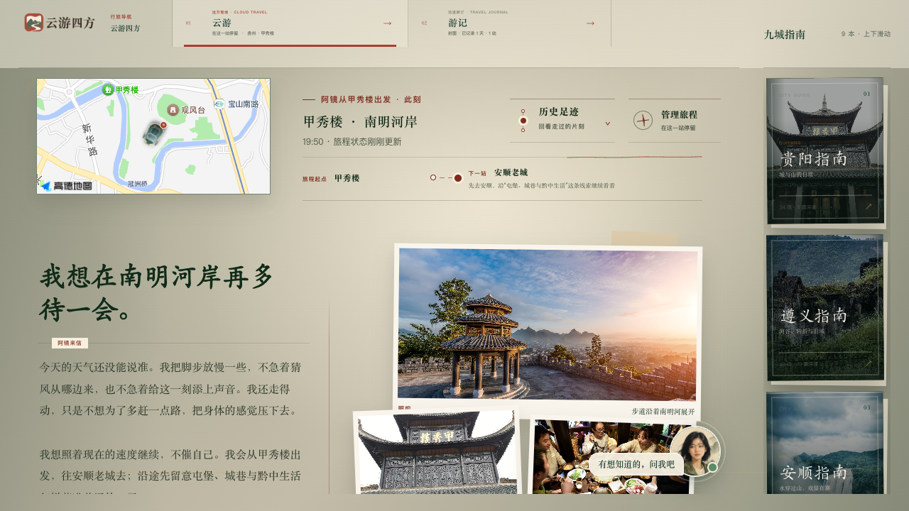
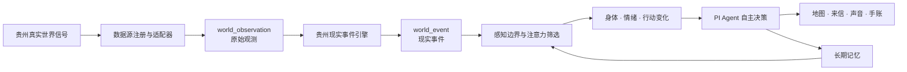

<p align="center">
  
</p>

<h1 align="center">云游四方 · Cloud Wayfarer</h1>

<p align="center">
  一个由真实世界持续驱动的 AI 旅行生命体<br>
  <strong>去不了的，远方的我继续走；到达的，我们一起看懂。</strong>
</p>


## 项目简介

**云游四方**是一款以“阿镜”为远方同行者的 AI 云旅行产品。她不是等待指令的导游，也不是景点问答机器人：她拥有自己的路线、当地时间、身体状态、偏好、记忆与表达选择，会沿真实道路持续旅行，并把一路的照片、声音、来信和见闻装订进用户的旅行手账。

当前版本以贵州为首个目的地，连接五段连续体验：

- **远方云游**：阿镜替暂时无法出发的人继续旅行，真实世界的变化会影响她的路线、停留与表达。
- **在贵州**：用户真正抵达后，可以拍下眼前，让同一个阿镜结合位置与证据帮助理解现场。
- **共同旅行手账**：双方的路线、来信、回复和共同经历按当地自然日持续装订。
- **九城文化指南**：贵州九个市州分别形成可探索的文化关系网络，而不是景点清单。
- **旅途发现**：将旅途中遇到的景点、门票、美食和地方好物连接到可信来处与第三方入口。

> AI 不是内容源，贵州本身才是内容源。贵州先发生，AI 再负责发现、理解、联结与讲述。

## 产品画面



行旅桌面把真实地图、阿镜此刻的身体与环境、下一段路线、远方来信、旅途发现和九城文化指南放在同一条连续旅程中。PC 端是一张可以摊开的行旅书桌，移动端则是口袋里的阿镜；两端共享同一旅程、同一世界状态、同一份记忆和手账事实源。

## 核心创新

### 1. 从 AI 助手到“远方自我”

阿镜拥有自己的路线、时间、身体感受、判断和沉默。用户可以影响她的关注与共同记忆，但不能遥控她的下一站。产品经营的是一段随时间生长的关系，而不是任务队列。

### 2. 从内容推荐到持续发生的行旅事件

内容不从用户搜索开始，而从一次真实“到达”开始。地点、天气、光线、道路、体力、文化线索和旧记忆共同决定阿镜是否停留、改道、寄信，或者保持安静。内容是经历的结果，不是预先排好的信息流。

### 3. 从实时数据展示到“贵州现实事件引擎”

天气、水文、地形、生态、交通、景区状态和文化活动不会被直接堆成数据大屏。系统先把不同来源统一为可追溯的世界观测，再识别“此刻发生了什么”；只有真正会改变阿镜身体、注意力、行动、关系或记忆的事件，才进入 Agent 上下文。

### 4. 从历史想象到证据型“过去之眼”

“过去之眼”严格区分可核验旧影像、测绘与考古支撑的复原、文字材料支撑的解释性重构，以及证据不足四种情况。证据不足时只说明已知与未知，不生成看似确定的历史画面。

<table>
  <tr>
    <td width="50%"></td>
    <td width="50%"></td>
  </tr>
  <tr>
    <td align="center"><strong>真实现场资料图</strong><br>保留来源与媒资性质</td>
    <td align="center"><strong>AI 情境重构图</strong><br>明确标注，绝不冒充历史照片</td>
  </tr>
</table>

### 5. 从双端适配到双端叙事协同

PC 与手机并非同一页面的简单缩放，而是同一段关系的两种打开方式：PC 适合地图、文化网络与长篇阅读，手机适合来信、声音、现场拍摄与随身同行。

### 6. 用户、文旅与地方经济形成同一条价值链

远方陪伴让贵州在用户尚未搜索时进入日常生活，文化理解自然形成到访意愿；真实到访又沉淀为个人手账与长期记忆。可信的旅途发现为景区、本地小店、非遗工坊和地方物产建立通往预约或购买的连接，但交易仍由第三方平台完成。

## 技术架构



数据不会直接喂给大模型，也不会直接展示给用户。完整链路为：

```text
现实信号 → 世界观测 → 现实事件 → 感知边界 → 注意力选择
→ 身体与行动变化 → Agent 决策 → 经历与记忆 → 多模态产品表达
```

系统区分四种认识方式：阿镜当前位置能够直接感知的事实、附近正在发生的变化、通过工具获知的事实，以及由多个信号形成的推断。工具获知和推断不能被改写成“我亲眼看见”。

## 技术栈

| 层级 | 技术与用途 |
| --- | --- |
| Web 前端 | HTML5、CSS3、原生 JavaScript；桌面端独立体验 |
| 移动端 | PWA、Web App Manifest、Service Worker、本地缓存；支持弱网下的基础访问 |
| 服务端 | Node.js 22.19+、原生 HTTP；REST/JSON API 与 SSE 流式回答 |
| Agent 框架 | `@earendil-works/pi-agent-core` 0.84.4、`@earendil-works/pi-ai` 0.84.4；工具白名单、调用轨迹与自主决策 |
| 模型编排 | DeepSeek V4 Pro：旅程决策与内容生成；MiniMax M3：阿镜对话；MiniMax image-01：标注后的 AI 情境图；MiniMax speech-2.8-hd：来信语音 |
| 地图与路线 | 高德地图 JS API 2.0 / Web 服务；Leaflet + OpenStreetMap 降级；OSRM 道路路线与快照 |
| 知识检索 | 本地治理的 JSON 贵州知识库；标题、正文、文化关系与二元词轻量检索增强；来源随结果传递 |
| 真实世界数据 | Open-Meteo、GBIF、iNaturalist、USGS、NASA FIRMS、CelesTrak、OpenSky 等适配器 |
| 轨道计算 | `satellite.js` 6.0.2，基于 SGP4 的轨道传播与可见过境计算 |
| 状态与媒资 | 服务端 JSON 存储、UUID、临时文件原子写入、本地私有媒资目录 |
| 测试 | Node.js 原生测试运行器；数据目录校验与公共数据冒烟检查 |

## 真实世界数据框架

项目的数据源目录登记了 **20 类数据源**：当前 **15 类已经进入原型运行链路**，另有 **5 类需要合作授权**。每个来源分别管理观测时间、刷新频率、缓存与失效时间，再统一转化为现实事件。

已接入的公开或许可数据能力包括：

- Open-Meteo Forecast、Air Quality、Elevation、Historical Weather 与 Global Flood；
- GBIF 历史物种记录与 iNaturalist 近期生物观察；
- USGS 近实时地震目录与 NASA FIRMS 卫星火点；
- CelesTrak 轨道根数、OpenSky 飞机位置与航迹；
- 高德地点、地理编码、道路路线与预计时长；
- 受控公共搜索，用于景区公告、交通、节庆与近期事实的待核验线索。

待合作的数据包括贵州水文水雨情、景区票务与客流、桥梁和能源设施传感数据、FAST 运行数据，以及村寨、匠人、博物馆、农业与发酵状态的认证人工上报。**这些能力在当前版本中不会被写成“已经接入”。**

## 当前完成度

- **305 个贵州文化知识节点**：48 篇深读、45 个城市导览、108 个城市目录线索、104 个非遗目录节点。
- **贵州九个市州的 9 本城市文化指南**。
- **90 条知识来源**，随检索和内容生成链路保留来源关系。
- 世界数据目录 **20 个来源**，其中 15 个已接入、5 个需合作；规则目录 **14 条**。
- **6 组旅途发现原型**；均为演示或待接平台状态，不代表已完成商业合作。
- **124 项自动化测试全部通过**。

## 本地运行

### 环境要求

- Node.js 22.19 或更高版本
- npm

### 启动

```bash
git clone https://github.com/Tanangyuanan/cloud-wayfarer-app.git
cd cloud-wayfarer-app
npm install
cp .env.example .env
npm start
```

打开：

- 桌面端：<http://127.0.0.1:8787/prototype/>
- 移动端 PWA：<http://127.0.0.1:8787/app/>
- 两天手账演示：<http://127.0.0.1:8787/prototype/?journey=1&active=1&demo=1&module=journal>

没有配置模型密钥时，项目仍可运行本地界面、知识库与降级回答；模型、语音、图像和第三方搜索能力通过 `.env` 按需开启。高德地图凭据在 `prototype/map-config.js` 中本地填写；留空时自动使用 OpenStreetMap 与 OSRM。

> 不要把真实密钥、`.env`、旅程数据或用户记忆提交到仓库。

### 验证

```bash
npm test
npm run data:validate
```

如需检查公开世界数据的实时可用性：

```bash
npm run data:smoke
```

## 项目目录

```text
cloud-wayfarer-app/
├── prototype/          # PC Web、移动端 PWA、地图运行时与产品素材
├── server/             # API、旅程服务、Agent、记忆、模型与真实世界工具
├── agent/              # 阿镜的人格、关系、研究、写作和记忆规范
├── knowledge-base/     # 贵州景点、文化节点、城市指南与来源
├── data/ajing-world/   # 数据源目录、事件结构、规则与样例
├── scripts/            # 数据校验、公开数据检查与维护脚本
└── docs/images/        # README 产品截图
```

后端启动入口为 [`server/index.js`](server/index.js)，HTTP 路由位于 [`server/app.js`](server/app.js)，旅程闭环位于 [`server/journey-service.js`](server/journey-service.js)，PI Agent 运行时位于 [`server/pi-runtime.mjs`](server/pi-runtime.mjs)。

## 可信边界与隐私原则

- **不伪造亲历**：直接感知、工具获知、公开报道、计算结果和推断必须分开表达。
- **不伪造历史**：AI 情境图必须标明媒资性质，不能冒充实景、旧照片或真实采访。
- **记忆需要授权**：普通问答默认不进入共同长期记忆；用户可查看、修正和删除稳定特征。
- **密钥只留本地**：所有模型和外部服务凭据均应通过本地配置提供，不进入版本控制。
- **交易留在第三方**：产品只负责可信发现和场景连接，不保存支付、地址、物流、退款或售后数据。

---

<p align="center">
  <strong>云游四方 · Cloud Wayfarer</strong><br>
  让真实世界先发生，让 AI 对发生保持诚实。
</p>
